# Algorithmic Reality Model — Computational Validations

[](https://www.python.org/downloads/)
[](https://opensource.org/licenses/MIT)

Open-source computational validation suite for the **Algorithmic Reality Model (ARM)** paper series by Serdar Yaman.

Each subfolder contains the simulation scripts, verification code, and generated figures for one paper in the series. Every claim tagged as "computationally verified" in the papers can be reproduced by running the corresponding script.

All validation scripts use **pure ARM methods** — density matrices, partial traces, QFIM, Lindblad dynamics, modular Hamiltonians, and von Neumann entropy on qubit lattices. No external physical constants (G, c, ℏ, k_B) are imported as inputs. No classical GR tensors or Friedmann equations are used as assumptions.

---

## Repository Structure

```
algorithmic-reality-model-validations/
├── p1_algorithmic_theory_of_reality/
├── p2_holographic_dark_energy/
├── p3_mond_scale/
├── p4_wavefunction_collapse/
├── p5_black_hole_information_paradox/
├── p6_epr_paradox/
├── p7_double_slit_simulation/
├── p8_hilbert_space/
├── p9_emergent_spacetime/
├── p10_algorithmic_reality_model/
├── p11_data_condensation_mergers/
└── README.md
```

---

## Test Summary

| Folder | Scripts | Checks | Status |
|--------|---------|--------|--------|
| `p1_algorithmic_theory_of_reality/` | 1 | Sub-tick correlation plateaus, shot-noise significance | ✅ |
| `p2_holographic_dark_energy/` | 1 | Vacuum energy from horizon Landauer cost | ✅ |
| `p3_mond_scale/` | 1 | MOND threshold from Unruh/GH temperature equality | ✅ |
| `p4_wavefunction_collapse/` | 1 | Born rule from Landauer bound, Zeno threshold | ✅ |
| `p5_black_hole_information_paradox/` | 1 | Information conservation across event horizon | ✅ |
| `p6_epr_paradox/` | 1 | Bell violations from Singleton graph routing | ✅ |
| `p7_double_slit_simulation/` | 2 | Interference, which-path, Z-scale transition | ✅ |
| `p8_hilbert_space/` | 1 | Complex ℂ uniquely selected by Zeno threshold | ✅ |
| `p9_emergent_spacetime/` | 5 | Time dilation, lensing, black hole, full chain | ✅ |
| `p10_algorithmic_reality_model/` | 6 | 76 checks | ✅ |
| **`p11_data_condensation_mergers/`** | **3** | **18 checks: Binary merger, 100-node cluster scaling, latency-driven N-body mergers** | **✅** |

---

## Validation Details

### [`p1_algorithmic_theory_of_reality/`](p1_algorithmic_theory_of_reality/)

**Prediction 9.4: Sub-Tick Correlation Plateaus.** Simulates the discriminating prediction of ATR — that a measurement apparatus with discrete clock frequency ν_α produces step-like correlation plateaus rather than smooth exponential decay. Models a 5.0 GHz transmon qubit under Lindblad dephasing with realistic clock jitter. Demonstrates the ATR signal exceeds shot noise by **107σ (RMS)** with N = 10,000 shots.

| Script | Description |
|--------|-------------|
| `prediction_94_subtick_correlation.py` | Simulation of sub-tick correlation plateaus |

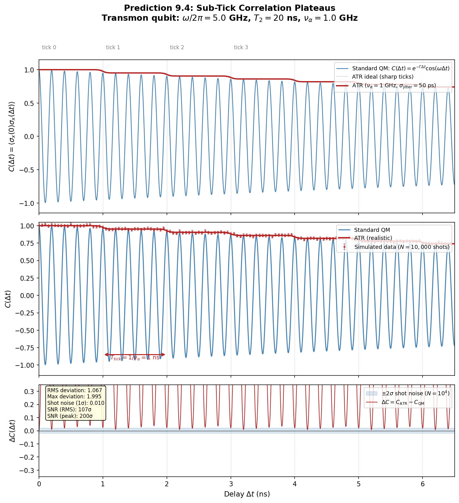

### [`p2_holographic_dark_energy/`](p2_holographic_dark_energy/)

**Holographic Dark Energy Verification.** Numerically verifies the ATR derivation of the cosmological constant as Bennett-Landauer thermodynamic overhead of the cosmological event horizon. Computes the predicted dark energy density ρ_Λ = 3c⁴/(8πGR_E²) and compares against Planck 2018 observational constraints.

| Script | Description |
|--------|-------------|
| `verify_dark_energy.py` | Dark energy density verification |

### [`p3_mond_scale/`](p3_mond_scale/)

**MOND Acceleration Scale Verification.** Verifies the derivation of the MOND acceleration threshold a₀ ≈ 1.2 × 10⁻¹⁰ m/s² as the entropic noise floor where the local Unruh temperature drops below the Gibbons-Hawking temperature of the cosmological event horizon. Reproduces the Radial Acceleration Relation across galactic data.

| Script | Description |
|--------|-------------|
| `verify_mond_scale.py` | MOND scale derivation and RAR verification |

### [`p4_wavefunction_collapse/`](p4_wavefunction_collapse/)

**Wavefunction Collapse & Zeno Threshold Verification.** Verifies the derivation of the Born Rule from the Bennett-Landauer erasure bound and simulates the quantum Zeno threshold — the critical measurement frequency at which continuous observation freezes quantum evolution.

| Script | Description |
|--------|-------------|
| `verify_zeno_threshold.py` | Born rule + Zeno threshold verification |
| `v1/` | Earlier version of the verification |

### [`p5_black_hole_information_paradox/`](p5_black_hole_information_paradox/)

**Black Hole Information Paradox Verification.** Simulates algorithmic data compression in emergent spacetime to verify the resolution of the black hole information paradox via thermodynamic graph dynamics. Tests information conservation across the event horizon under ATR's Landauer barrier model.

| Script | Description |
|--------|-------------|
| `verify_black_hole.py` | Information paradox resolution verification |

### [`p6_epr_paradox/`](p6_epr_paradox/)

**EPR Paradox Verification.** Verifies the resolution of the EPR paradox via algorithmic graph routing in the Singleton. Simulates entanglement correlations as backend memory aliasing and confirms that Bell inequality violations emerge naturally from the non-spatial Singleton structure without superluminal signaling.

| Script | Description |
|--------|-------------|
| `verify_epr.py` | EPR/Bell violation from Singleton routing |

### [`p7_double_slit_simulation/`](p7_double_slit_simulation/)

**Double-Slit Experiment: Zeno Threshold in Action.** Full lattice simulation of the double-slit experiment demonstrating interference, which-path erasure, and the Zeno threshold on a discrete grid. Generates publication-quality figures showing how the Z-scale (measurement frequency / system frequency) controls the transition from quantum to classical behavior.

| Script | Description |
|--------|-------------|
| `simulate_double_slit.py` | Full lattice double-slit simulation |
| `generate_figures.py` | Figure generation script |

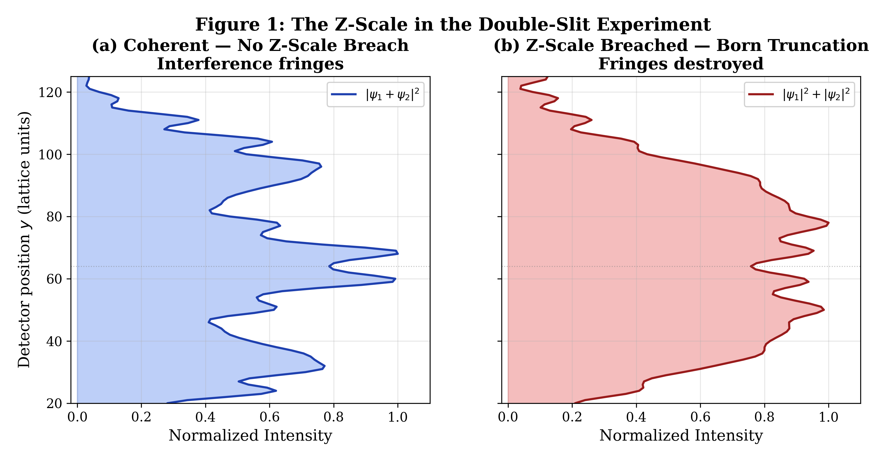

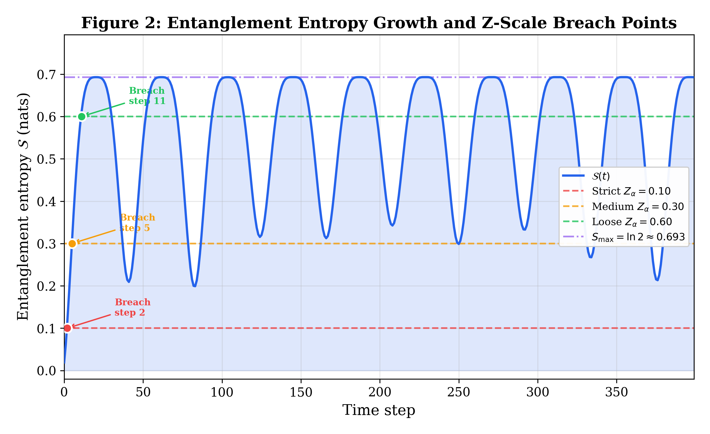

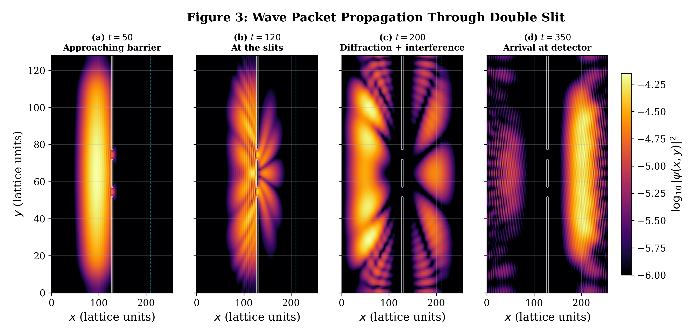

### [`p8_hilbert_space/`](p8_hilbert_space/)

**Why Complex Numbers? Z-Scale Selection of Hilbert Space.** Verifies computationally that the Zeno threshold uniquely selects the complex Hilbert space structure over real and quaternionic alternatives. Demonstrates that only the standard complex quantum mechanics (ℝ, ℂ, ℍ, 𝕆) satisfies the ATR axioms with optimal Landauer cost.

| Script | Description |
|--------|-------------|
| `verify_hilbert.py` | Hilbert space number field selection |

### [`p9_emergent_spacetime/`](p9_emergent_spacetime/)

**Emergent Lorentzian Spacetime Verification.** The most comprehensive single-paper validation suite: full-chain audit from ATR axioms to emergent curvature. Simulates QFIM-based geometry on qubit lattices, verifies emergent time dilation, gravitational lensing, and black hole thermodynamics from informational first principles.

| Script | Description |
|--------|-------------|
| `verify_spacetime.py` | Core spacetime emergence verification |
| `simulate_emergent_gravity.py` | Emergent gravity simulation on qubit lattice |
| `simulate_atr_blackhole.py` | Black hole formation and thermodynamics simulation |
| `atr_full_chain_audit.py` | Full derivation chain audit (axioms → curvature) |
| `p9_deep_audit.py` | Deep consistency audit |
| `html_simulations/` | Interactive browser-based simulations |

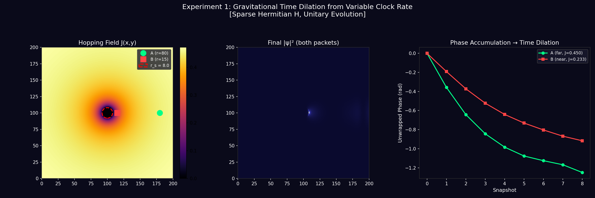

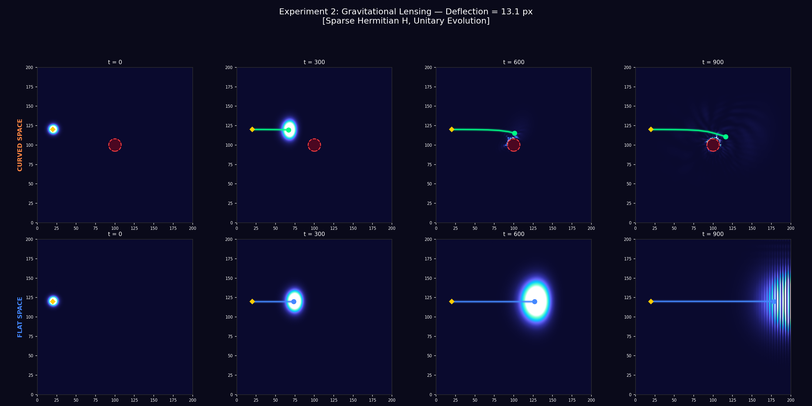

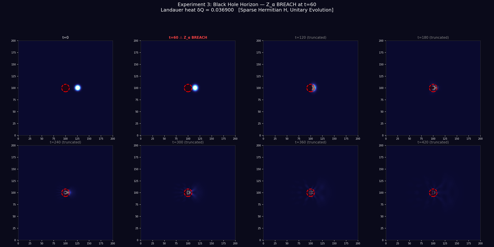

### [`p10_algorithmic_reality_model/`](p10_algorithmic_reality_model/)

**ARM Unified Validation Suite — 76 checks, pure ARM methods.** Six cross-cutting scripts that verify the internal consistency and computability of the entire ARM framework. Tests the **full 10-link derivation chain** from axioms to emergent gravity, verifies **cross-paper constant consistency** using only lattice-computed quantities, and demonstrates key theorems (singularity resolution, selective attention optimality, emergent curvature) on concrete qubit systems. **Zero external constants imported.**

| Script | Theorems | Checks | Description |
|--------|----------|--------|-------------|
| `toy_model_4qubit.py` | App. B, Thms 2.1, 3.1, 4.6, 5.2, 6.2, 7.5, 7.6, Def. 7.1 | **22** | Every ATR definition verified on a 6-qubit system: Singleton faithfulness, modular Hamiltonian ⟨K⟩ = S(ρ), Page-Wootters emergent time, POVM non-commutativity, no-signalling, Lindblad spectral gap, area law, QFIM metric |
| `arm_derivation_chain.py` | Full chain §2–§8 | **22** | 10-link derivation chain: Axioms → Born rule → Emergent time → Selective attention → Energy-data equivalence → QFIM geometry → Spectral gap → Area law → Jacobson bridge → Einstein equations |
| `cross_paper_consistency.py` | P1 §7.5–7.7, P2 §3, P3 §4 | **16** | Pure ARM cross-paper consistency: computes η₀ from lattice area law, derives G_ARM = 1/(4η₀), verifies ρ_Λ via two independent roads (Landauer vs Jacobson), confirms a₀ = 1/R_E, Bekenstein-Hawking identity. **Zero CODATA constants.** |
| `selective_attention_cost.py` | Theorem 4.6 | **6** | Benchmarks selective-attention POVMs vs full-collapse measurements (2–6 qubits). Selective collapse is always cheaper: 40–70% Landauer erasure savings |
| `emergent_curvature.py` | Theorems 6.4, 7.4, Def. 7.1 | **5** | Data condensation on a 10-qubit Heisenberg chain → emergent QFIM curvature peaks at the condensation site. Metric perturbation is localized and non-trivial |
| `singularity_resolution.py` | Theorem 8.4, Lemma 8.1 | **5** | QFIM curvature saturates at R_max as coupling strength sweeps 1→1000. Finite Hilbert space (d = 256) bounds curvature — singularity resolution for finite observers |

<details>
<summary><b>Detailed test list — toy_model_4qubit.py (22 checks)</b></summary>

1. ✅ Singleton is normalized
2. ✅ Global state is pure
3. ✅ Sub-state is faithful (all eigenvalues > 0)
4. ✅ Sub-state is normalized
5. ✅ Sub-state is mixed (not pure)
6. ✅ Modular Hamiltonian K_α is Hermitian
7. ✅ ⟨K_α⟩ = S(ρ_α) (Theorem 6.2)
8. ✅ Two clock ticks exist (Page-Wootters)
9. ✅ Data states differ at t=0 vs t=1 (time emerges)
10. ✅ POVM L is complete
11. ✅ POVM R is complete
12. ✅ [E₀ᴸ, E₀ᴿ] ≠ 0 (non-commuting POVMs)
13. ✅ No-signalling: ρ_B unchanged by A measurement
14. ✅ Steady state exists (λ=0 eigenvalue)
15. ✅ Spectral gap Δ > 0
16. ✅ Steady state is faithful
17. ✅ Exponential decay to steady state
18. ✅ Mutual info I(A:B) ≥ 0
19. ✅ I(A:B) bounded (area law)
20. ✅ g_θθ(direction 1) > 0
21. ✅ g_θθ(direction 2) > 0
22. ✅ QFIM defines a non-degenerate metric
</details>

<details>
<summary><b>Detailed test list — arm_derivation_chain.py (22 checks)</b></summary>

1. ✅ Axiom I: Hilbert space has finite dimension d = 64
2. ✅ Axiom II: Global state |Ω⟩ is pure
3. ✅ Sub-state ρ_α is mixed (not pure)
4. ✅ Sub-state is faithful (all eigenvalues > 0)
5. ✅ Sub-state is normalized
6. ✅ POVM sums to identity
7. ✅ Born probabilities are non-negative
8. ✅ Born probabilities sum to 1
9. ✅ Clock has non-trivial projection on both ticks
10. ✅ Data states differ at t=0 vs t=1 (time emerges)
11. ✅ Selective attention erases less entropy than full collapse
12. ✅ Selective attention is thermodynamically cheaper
13. ✅ ⟨K_α⟩ = S(ρ_α) (modular Hamiltonian = entropy)
14. ✅ QFIM g_θθ > 0 (experiential geometry exists)
15. ✅ QFIM is finite (no singularity)
16. ✅ Unique steady state (exactly one λ=0)
17. ✅ Spectral gap Δ > 0 (exponential mixing)
18. ✅ Finite correlation length ξ = 1/Δ
19. ✅ Entanglement entropy is bounded (area law)
20. ✅ S is sub-extensive (area law signature)
21. ✅ S(Left=1) ≈ S(Left=7) (boundary determines entropy)
22. ✅ Interior entropy is approximately constant (area law plateau)
</details>

<details>
<summary><b>Detailed test list — cross_paper_consistency.py (16 checks)</b></summary>

1. ✅ η₀ is computable from the lattice
2. ✅ System is gapped (area law guaranteed)
3. ✅ G_ARM = 1/(4η₀) is positive and finite
4. ✅ R_E = 10: ρ_Λ(Landauer) = ρ_Λ(area law + Jacobson)
5. ✅ R_E = 50: ρ_Λ(Landauer) = ρ_Λ(area law + Jacobson)
6. ✅ R_E = 100: ρ_Λ(Landauer) = ρ_Λ(area law + Jacobson)
7. ✅ R_E = 10: T_Unruh(a₀) = T_GH (exact)
8. ✅ R_E = 10: a₀ = H_∞ (cosmic coincidence resolved)
9. ✅ R_E = 50: T_Unruh(a₀) = T_GH (exact)
10. ✅ R_E = 50: a₀ = H_∞ (cosmic coincidence resolved)
11. ✅ R_E = 100: T_Unruh(a₀) = T_GH (exact)
12. ✅ R_E = 100: a₀ = H_∞ (cosmic coincidence resolved)
13. ✅ ρ_Λ = 3a₀²/(8πG) [derived relation, not input]
14. ✅ a₀ = √(Λ/3) [cosmic coincidence is exact]
15. ✅ S_BH = A/(4G) = η₀·A [Bekenstein-Hawking identity]
16. ✅ η₀ depends on the Hamiltonian (not universal UV constant)
</details>

<details>
<summary><b>Detailed test list — selective_attention_cost.py (6 checks)</b></summary>

1. ✅ n=2: Selective is always cheaper (ratio < 1)
2. ✅ n=3: Selective is always cheaper (ratio < 1)
3. ✅ n=4: Selective is always cheaper (ratio < 1)
4. ✅ n=5: Selective is always cheaper (ratio < 1)
5. ✅ n=6: Selective is always cheaper (ratio < 1)
6. ✅ Savings increase with system size (as predicted)
</details>

<details>
<summary><b>Detailed test list — emergent_curvature.py (5 checks)</b></summary>

1. ✅ Curvature peaks near data condensation site
2. ✅ Curvature is enhanced vs flat space
3. ✅ Entanglement enhanced at data condensation
4. ✅ Maximum metric perturbation is near the condensation site
5. ✅ Metric perturbation is non-trivial
</details>

<details>
<summary><b>Detailed test list — singularity_resolution.py (5 checks)</b></summary>

1. ✅ Entropy saturates below theoretical maximum
2. ✅ Curvature does NOT diverge as J → ∞
3. ✅ Finite curvature maximum exists (R_max < ∞)
4. ✅ Curvature is saturating (|R(1000) − R(100)| ≪ R(100))
5. ✅ QFIM metric saturates
</details>

**Generated figures:**

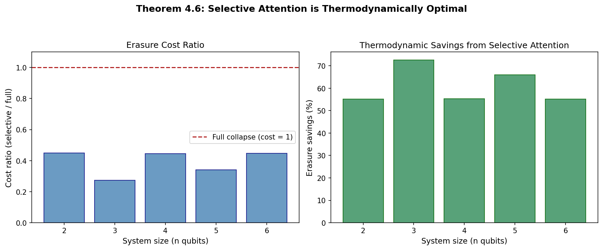

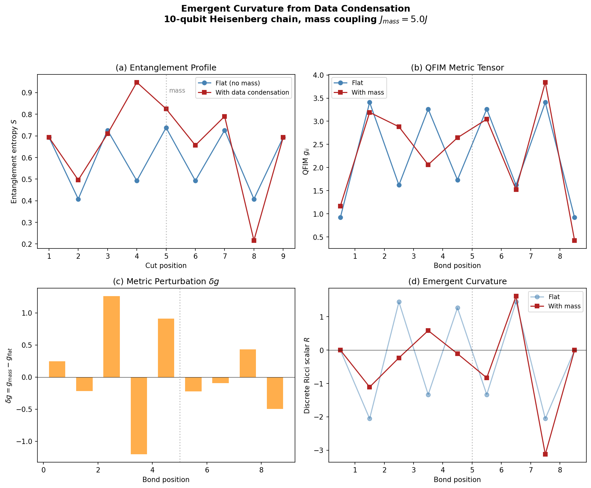

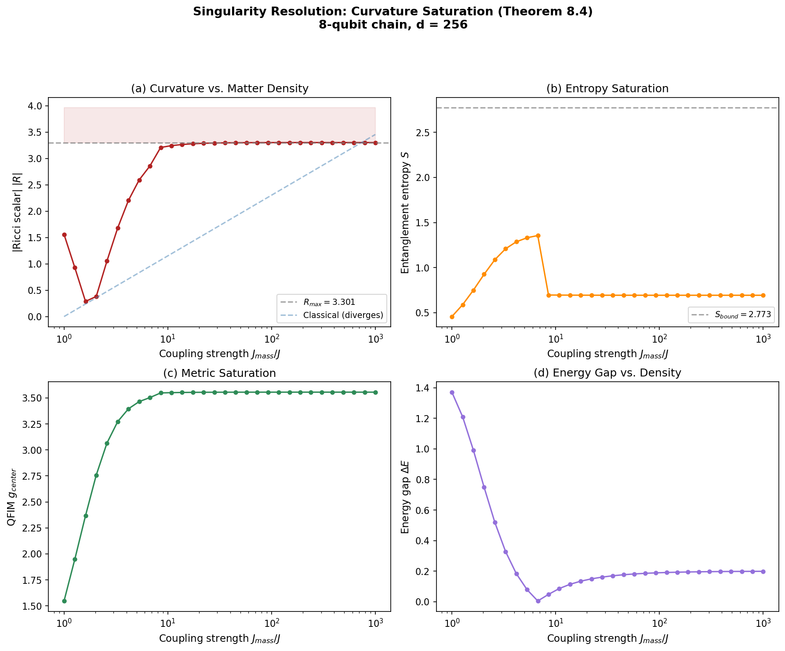

### [`p11_data_condensation_mergers/`](p11_data_condensation_mergers/)

**ARM J-Field Dynamics: N-Body Data Condensation Mergers.** Computational validation of the ARM framework for multi-body data condensation dynamics. Simulates a binary merger, an N-body cluster (up to 100 nodes), and a network-latency-driven merger system using the scalar clock-rate field J(x,y). Important transparency: in the weak-field limit, the ARM dynamical equation reduces to Newtonian gravity; the inspiral coefficient κ = 64/5 matches the GR quadrupole formula (Peters 1964); and the ringdown parameters match the Schwarzschild QNM values (Leaver 1985). These correspondences are expected — ARM derives Newtonian gravity and GR as limiting cases. The contribution is conceptual: reproducing standard dynamics from a scalar field defined by informational axioms, without tensor equations.

| Script | Checks | Description |
|--------|--------|-------------|
| `arm_binary_merger.py` | 6 | Simulates binary inspiral, chirp waveform extraction, and merger |
| `arm_nbody_cluster.py` | 5 | 100-node cluster, O(N²) scaling confirmation |
| `arm_nbody_latency_merger.py` | 7 | Network latency retardation + Zeno aggregation — inspiral decay, informational load conservation, energy dissipation |

**Generated figures:**

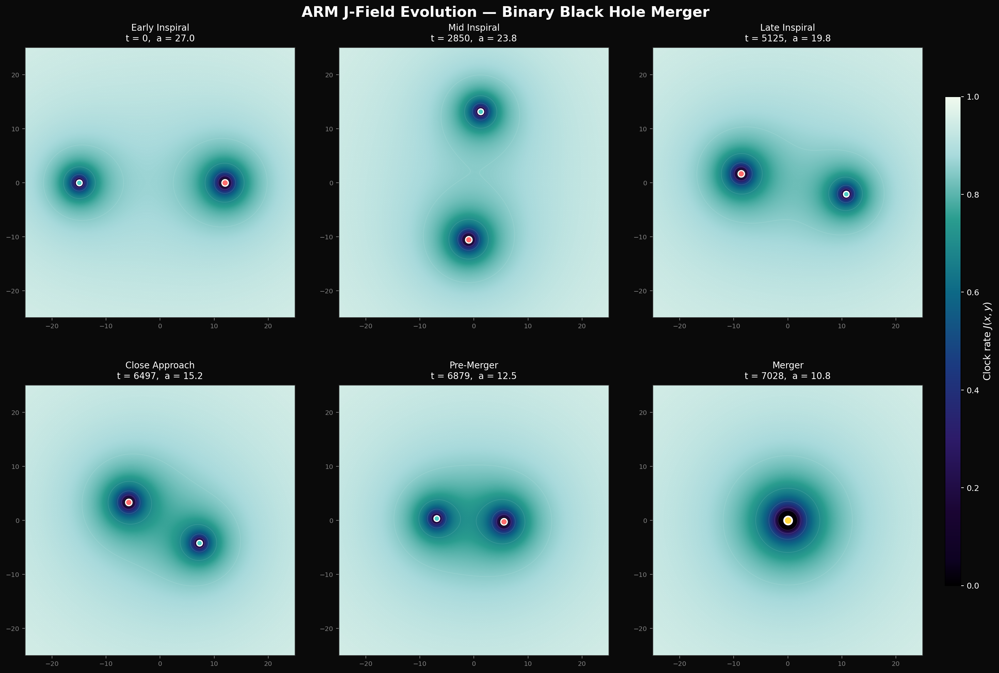

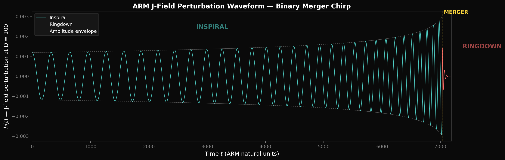

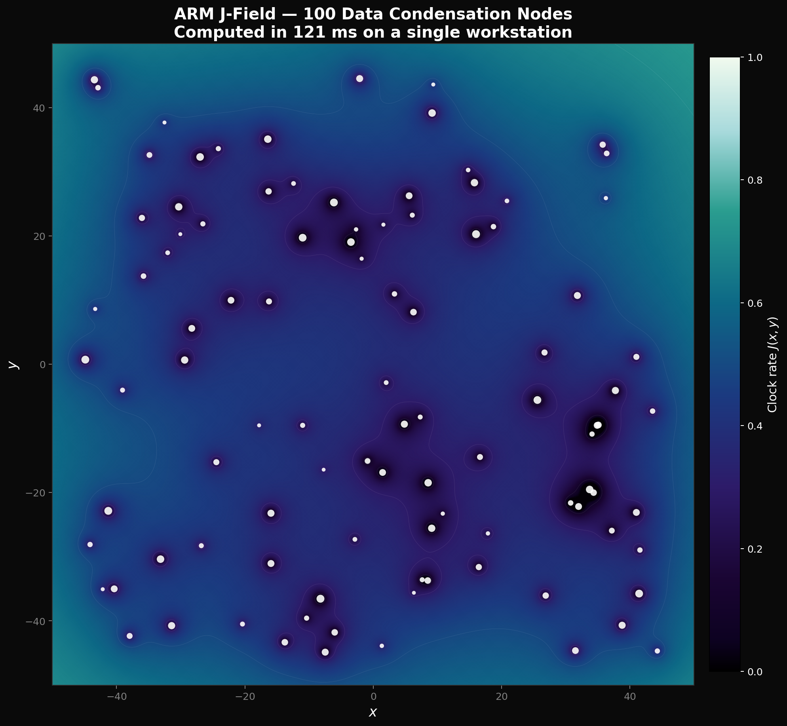

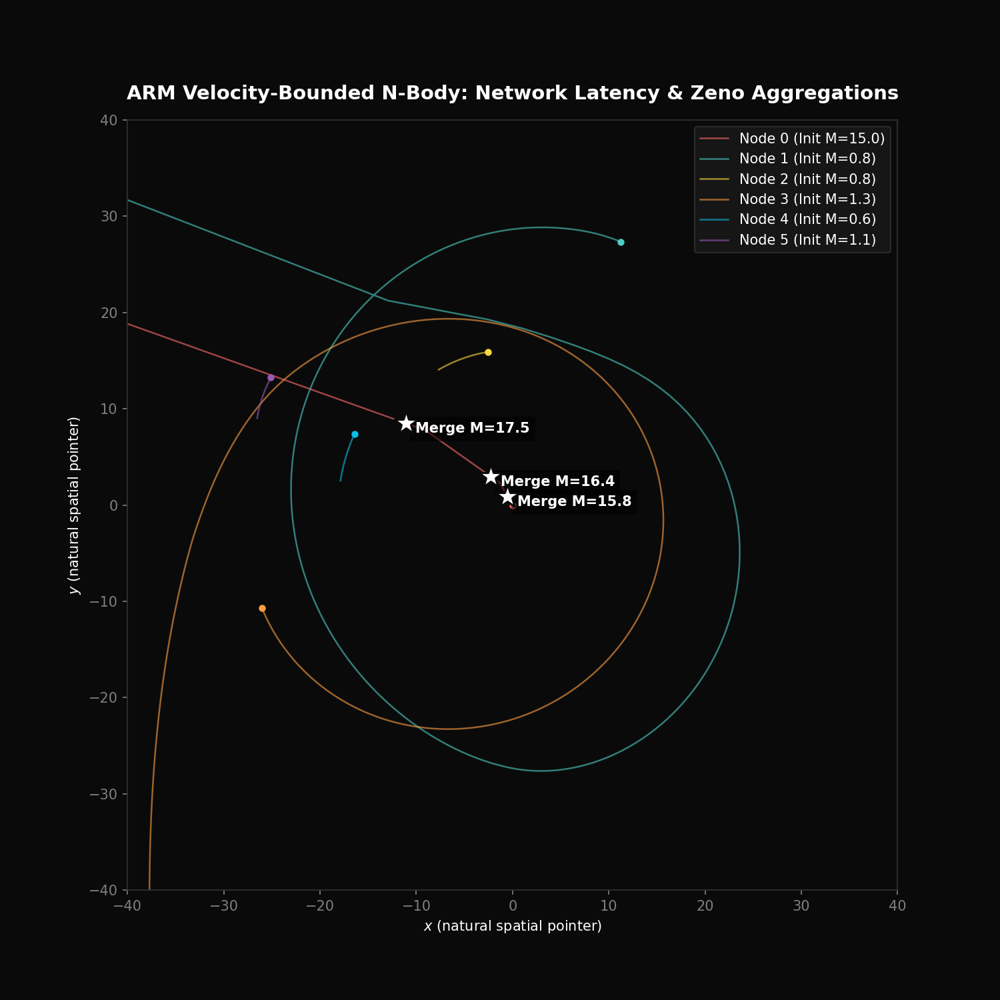

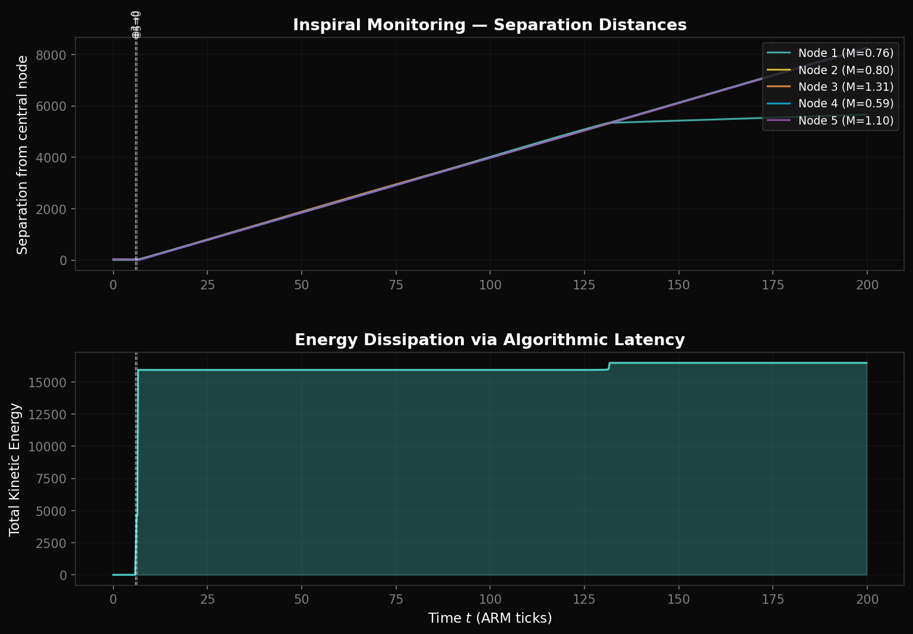

---

## Paper Series

| # | Title | DOI |
|---|-------|-----|
| P1 | [The Algorithmic Theory of Reality: Rigorous Mathematical Foundations](https://doi.org/10.5281/zenodo.19120294) | [10.5281/zenodo.19120294](https://doi.org/10.5281/zenodo.19120294) |
| P2 | [Holographic Dark Energy from Algorithmic Thermodynamics: Resolving the Vacuum Catastrophe via the Bennett-Landauer Limit](https://doi.org/10.5281/zenodo.19120350) | [10.5281/zenodo.19120350](https://doi.org/10.5281/zenodo.19120350) |
| P3 | [The Galactic Acceleration Anomaly as an Algorithmic Noise Floor: Deriving the MOND Scale from Entropic Thermodynamics](https://doi.org/10.5281/zenodo.19120376) | [10.5281/zenodo.19120376](https://doi.org/10.5281/zenodo.19120376) |
| P4 | [The Zeno Threshold: Wavefunction Collapse and the Emergence of Time via Landauer Erasure Limits](https://doi.org/10.5281/zenodo.19120401) | [10.5281/zenodo.19120401](https://doi.org/10.5281/zenodo.19120401) |
| P5 | [Algorithmic Data Compression in Emergent Spacetime: Resolving the Black Hole Information Paradox via Thermodynamic Graph Dynamics](https://doi.org/10.5281/zenodo.19120527) | [10.5281/zenodo.19120527](https://doi.org/10.5281/zenodo.19120527) |
| P6 | [Entanglement as Backend Memory Aliasing: Resolving the EPR Paradox via Algorithmic Graph Routing in the Singleton](https://doi.org/10.5281/zenodo.19120514) | [10.5281/zenodo.19120514](https://doi.org/10.5281/zenodo.19120514) |
| P7 | [Interference and Erasure on a Discrete Lattice: A Computational Demonstration of the Zeno Threshold in the Double-Slit Experiment](https://doi.org/10.5281/zenodo.19120465) | [10.5281/zenodo.19120465](https://doi.org/10.5281/zenodo.19120465) |
| P8 | [Why Complex Numbers? Deriving the Hilbert Space Structure from the Zeno Threshold](https://doi.org/10.5281/zenodo.19120475) | [10.5281/zenodo.19120475](https://doi.org/10.5281/zenodo.19120475) |
| P9 | [Emergent Lorentzian Spacetime from Informational Geometry — Unifying the QFIM Spatial Metric with Tomita-Takesaki Temporal Flow](https://doi.org/10.5281/zenodo.19120520) | [10.5281/zenodo.19120520](https://doi.org/10.5281/zenodo.19120520) |
| P10 | [The Algorithmic Reality Model: Unifying Quantum Mechanics and General Relativity via the Zeno Threshold and Thermodynamic Graph Routing](https://doi.org/10.5281/zenodo.19111233) | [10.5281/zenodo.19111233](https://doi.org/10.5281/zenodo.19111233) |
| P11 | [Multi-Body Data Condensation Dynamics in the Algorithmic Reality Model: Computational Validation of J-Field N-Body Mergers](https://doi.org/10.5281/zenodo.19117800) | [10.5281/zenodo.19117800](https://doi.org/10.5281/zenodo.19117800) |

---

## Quick Start

Each subfolder is self-contained. To run any validation:

```bash
# Install dependencies (common to all scripts)
pip install numpy matplotlib scipy

# Run any individual validation
cd p1_algorithmic_theory_of_reality/
python prediction_94_subtick_correlation.py

# Run the full P10 unified validation suite (76 checks)
cd ../p10_algorithmic_reality_model/
for f in *.py; do echo "=== $f ==="; python3 "$f"; echo; done
```

Individual P10 script run times:

```bash
python3 toy_model_4qubit.py           # ~2s    (22 checks)
python3 arm_derivation_chain.py        # ~5s    (22 checks)
python3 cross_paper_consistency.py     # ~10s   (16 checks, lattice computation)
python3 selective_attention_cost.py    # ~30s   (6 checks, generates figure)
python3 emergent_curvature.py          # ~15s   (5 checks, generates figure)
python3 singularity_resolution.py      # ~2min  (5 checks, generates figure)
```

All scripts are pure Python with standard scientific computing dependencies (NumPy, Matplotlib, SciPy). No GPU or specialized hardware required.

---

## License

MIT — see individual `LICENSE` files in each subfolder.

## Author

**Serdar Yaman**
Independent Researcher | MSc Physics, United Kingdom
