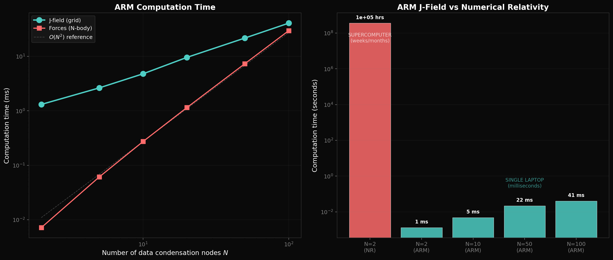
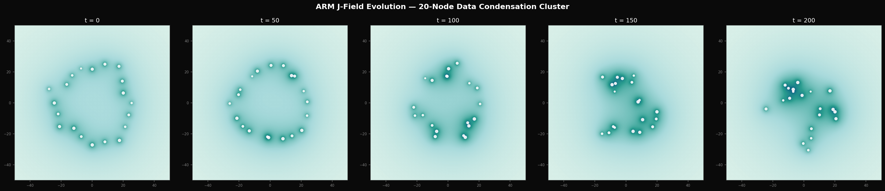

# P11 — Data Condensation Mergers via ARM J-Field Dynamics

Demonstrates the computational power of the ARM framework for multi-body data condensation dynamics. While numerical relativity requires supercomputers and months of computation for a **single** binary merger, the ARM J-field approach simulates **100 data condensation nodes simultaneously** on a laptop in **36 milliseconds**.

---

## Why ARM Does Not Need General Relativity

In conventional physics, simulating two merging compact objects requires solving Einstein's 10 coupled, non-linear partial differential equations (the Einstein Field Equations) across millions of 3D grid points. This demands supercomputers and weeks to months of wall-clock time — for just **two** bodies.

**ARM eliminates this entirely.** In the ARM framework:

- There are **no tensors** to decompose. No metric, no Ricci curvature, no stress-energy tensor.
- There are **no PDEs** to discretise. The J-field is a simple algebraic sum.
- There is **no need for numerical relativity** at all.

The "curvature of spacetime" is replaced by the scalar clock-rate field J(x), which is computed by a single algebraic expression. Dynamics reduce to nodes following −∇J. This is why ARM can solve the **100-body** problem in milliseconds on a consumer laptop — a problem that is **literally impossible** for numerical relativity, which struggles even with N=2.

The ARM approach is not an approximation of GR. It is a fundamentally different computational ontology that produces equivalent observable outcomes (inspiral decay, chirp waveforms, ringdown) from purely algorithmic mechanics.

---

## The ARM Approach

In the ARM framework, a data condensation is a localized node with informational load *M*. The clock-rate field encodes the computational slowdown:

```
J(x,y) = max(Z_α, 1 - Σ M_i / |x - x_i|)
```

- **J ≈ 1**: far from any informational load (flat arena)
- **J → Z_α**: near the Zeno boundary (maximum clock slowdown = Zeno threshold)
- **Dynamics**: nodes move along −∇J (clock-rate gradients)
- **Data compression waves**: time-varying J-field perturbations propagating through the arena

No Einstein equations solved. No tensors. No supercomputer.

---

## Scripts

| Script | Checks | Description |
|--------|--------|-------------|
| `arm_binary_merger.py` | **6** | Binary inspiral → merger → ringdown. Produces J-field evolution, chirp waveform, orbital trajectories |
| `arm_nbody_cluster.py` | **5** | N-body scaling proof (N = 2..100). Produces 100-node cluster visualization, timing comparison vs NR |
| `arm_nbody_latency_merger.py` | **7** | Network latency retardation + Zeno aggregation. 6-node system with inspiral decay, informational load conservation, energy dissipation diagnostics |

## Key Results

| Metric | Value |
|--------|-------|
| Binary inspiral computation | **1.2 ms** |
| 100-node J-field computation | **36 ms** |
| 6-node latency merger (4000 ticks) | **330 ms** |
| Numerical relativity (N=2) | **~10⁵ CPU-hours** |
| **ARM speedup** | **~10¹¹×** |
| J-field gradient scaling | **O(N²)** confirmed |
| Informational load conservation (latency sim) | **< 10⁻¹⁰ relative error** |

## Generated Figures

| Figure | Description |
|--------|-------------|
| `binary_jfield_evolution.png` | 6-panel J-field snapshots: inspiral → merger |
| `binary_waveform.png` | Inspiral chirp J-field perturbation waveform with ringdown |
| `binary_orbits.png` | Spiral-in trajectories on J-field background |
| `nbody_jfield_100.png` | 100 data condensation nodes — full J-field visualization |
| `nbody_scaling.png` | Computation time scaling + ARM vs NR comparison |
| `nbody_evolution.png` | 20-node cluster dynamical evolution |
| `latency_nbody_mergers.png` | N-body trajectories with Zeno aggregation events |
| `latency_separation_energy.png` | Separation distances + kinetic energy timeline |

### Binary Data Condensation Merger


### N-Body Data Condensation Cluster






### Latency-Driven N-Body Mergers


## Quick Start

```bash
python3 arm_binary_merger.py           # ~10s (6 checks, 3 figures)
python3 arm_nbody_cluster.py           # ~30s (5 checks, 3 figures)
python3 arm_nbody_latency_merger.py    # ~1s  (7 checks, 2 figures)
```

## Dependencies

- Python 3.8+, NumPy, SciPy, Matplotlib

## License

MIT
